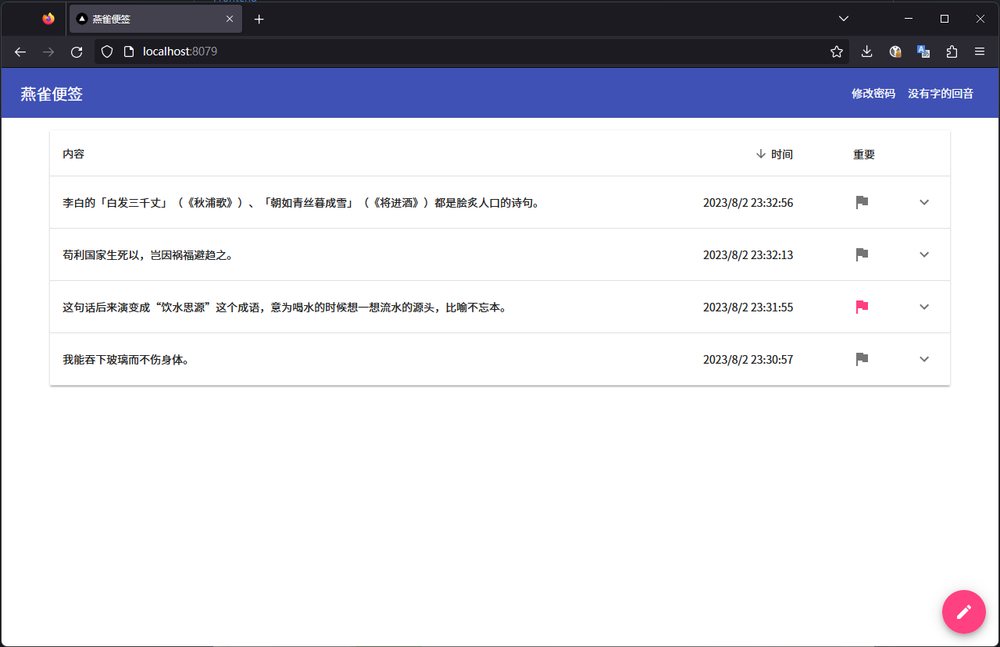

# 燕雀便签

燕雀便签是一个简易的便签网站。

后端（即本项目）由Java写成，采用了微服务架构。使用Consul作为配置中心与服务发现，依赖Redis与Spring Session实现了微服务间的session共享，并以OpenFeign跨微服务通信，还使用了Kafka做为消息队列。

[前端](https://github.com/Brambling-Apps/Brambling-Note-FE)是一个ReactJS项目，基于TypeScript，使用[Material UI](https://mui.com)库。

## 试用

通过Helm一键部署到Kubernetes上：[Brambling-Apps/helm-chart-actions](https://github.com/Brambling-Apps/helm-chart-actions)

或在线试用：（正在寻找适合部署K8s服务的服务器，先尝试[Node.js后端版](https://note.echo.moe)？）
